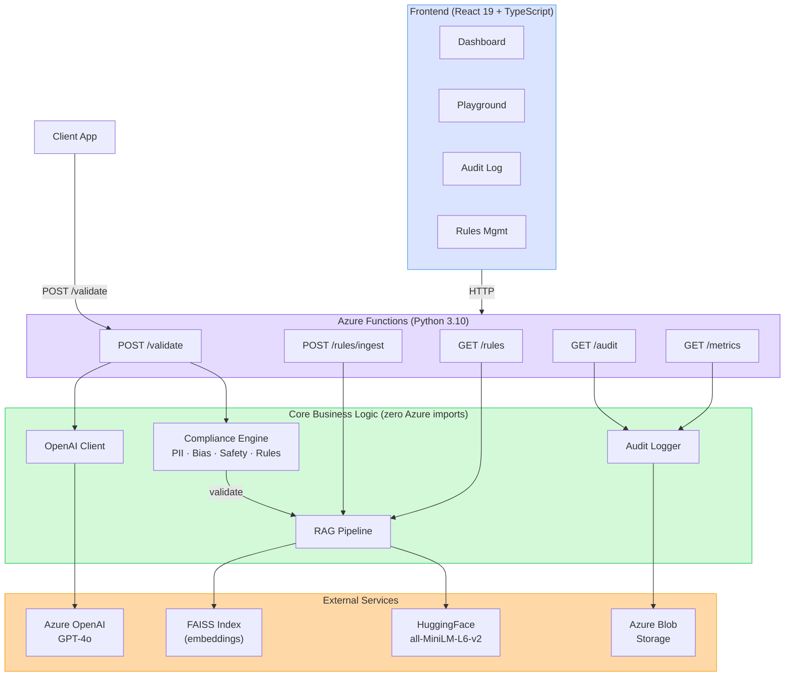

# SafeGen — Architecture

## System Overview

[](https://excalidraw.com/#json=AYeGdzU2odcXQHa4tp_DM,rXcDX6ii-NgvHYrm16a_Rg)



## System Design

SafeGen is a **serverless middleware** that sits between client applications and Azure OpenAI. It uses a multi-layer compliance engine with RAG-based policy retrieval to validate LLM outputs against dynamically loaded rule documents.

### Design Principles

1. **Serverless-first** — Azure Functions for zero-ops scaling
2. **Policy-as-data** — Compliance rules are documents, not code; update without redeployment
3. **Audit everything** — Every request/response pair logged for regulatory compliance
4. **Clean Architecture** — `core/` has zero Azure Functions imports; business logic is fully testable without the runtime
5. **Type-safe end-to-end** — Pydantic v2 on backend, strict TypeScript on frontend, snake_case throughout

## Folder Structure

```
safegen/
├── backend/
│   ├── function_app.py              # Azure Functions v2 entry point (blueprint registration)
│   ├── requirements.txt             # Python dependencies
│   ├── host.json                    # Azure Functions host config
│   ├── local.settings.example.json  # Template for local settings
│   ├── pyproject.toml               # Ruff + pytest config
│   │
│   ├── core/                        # Business logic (no Azure Functions dependencies)
│   │   ├── models.py                #   Pydantic v2: ValidateRequest/Response, ComplianceResult, AuditRecord, MetricsResponse
│   │   ├── openai_client.py         #   Azure OpenAI wrapper with GenerationResult dataclass
│   │   ├── rag_pipeline.py          #   Text extraction → chunking → embedding → FAISS index
│   │   ├── blob_storage.py          #   Azure Blob Storage CRUD with BlobMetadata
│   │   ├── compliance_engine.py     #   Orchestrates all validators, computes compliance score
│   │   ├── validators.py            #   PIIDetector, BiasChecker, SafetyFilter
│   │   └── audit_logger.py          #   Dual-backend audit store (FileAuditStore / BlobAuditStore)
│   │
│   ├── functions/                   # HTTP triggers (thin Blueprint wrappers)
│   │   ├── validate.py              #   POST /api/validate (LLM + compliance + audit)
│   │   ├── ingest_rules.py          #   POST /api/rules/ingest (file upload → FAISS)
│   │   ├── list_rules.py            #   GET  /api/rules (list ingested rules)
│   │   ├── audit.py                 #   GET  /api/audit (paginated, date/status filter)
│   │   └── metrics.py               #   GET  /api/metrics (aggregated stats, time series)
│   │
│   └── tests/                       # 150 tests, all passing
│       ├── conftest.py              #   Shared fixtures: mock_env, mock_openai_client
│       ├── test_models.py           #   17 tests — Pydantic model validation
│       ├── test_openai_client.py    #   7 tests — Azure OpenAI wrapper
│       ├── test_validate.py         #   13 tests — /api/validate endpoint
│       ├── test_rag_pipeline.py     #   16 tests — extract, chunk, embed, FAISS, semantic search
│       ├── test_ingest_rules.py     #   8 tests — /api/rules/ingest endpoint
│       ├── test_compliance_engine.py #  27 tests — scoring, flag aggregation
│       ├── test_validators.py       #   40 tests — PII/bias/safety validators
│       ├── test_audit.py            #   10 tests — /api/audit endpoint
│       ├── test_audit_logger.py     #   6 tests — audit store backends
│       └── test_metrics.py          #   6 tests — /api/metrics endpoint
│
├── frontend/
│   ├── vite.config.ts               # Vite + Tailwind + @/ alias + /api proxy
│   ├── vitest.config.ts             # jsdom test env + path aliases
│   ├── components.json              # shadcn/ui config
│   └── src/
│       ├── App.tsx                   # BrowserRouter + route definitions
│       ├── main.tsx                  # React entry point (StrictMode)
│       ├── index.css                 # Tailwind v4 + light/dark tokens
│       ├── types/index.ts           # 1:1 mirror of backend Pydantic models
│       ├── services/api.ts          # Typed fetch wrappers + ApiError class
│       ├── hooks/                   # useApi<T>, useTheme
│       ├── lib/                     # cn(), formatters, constants
│       ├── components/
│       │   ├── ui/                  #   10 shadcn components
│       │   ├── layout/             #   Sidebar + Header + AppLayout
│       │   ├── dashboard/          #   KpiCard, TrendChart, FlagBreakdownChart, ScoreGauge
│       │   ├── playground/         #   PromptInput, ResultPanel, FlagList, ExamplePrompts
│       │   ├── audit/              #   AuditFilters, AuditTable, AuditPagination, AuditDetailModal
│       │   └── rules/              #   RuleUploader (drag-and-drop), RuleList
│       ├── pages/                   # DashboardPage, PlaygroundPage, AuditPage, RulesPage
│       └── test/                    # 53 tests (setup, mocks, component/page/service tests)
│
├── rules/                           # Sample compliance documents
│   ├── gdpr_content_rules.md
│   ├── bias_detection_policy.md
│   └── pii_handling_rules.md
│
├── ARCHITECTURE.md
├── BUILDPLAN.md
├── ROADMAP.md
└── README.md
```

## Data Flow

### Validation Pipeline (`POST /api/validate`)

```
1. Client sends { prompt, context?, rules_category? }
2. Azure Function receives and validates request (Pydantic)
3. Call Azure OpenAI GPT-4o with prompt → raw LLM response
4. Compliance Engine (sequential layers):
   a. PIIDetector — regex for email, phone, SSN, credit card, IPv4
   b. BiasChecker — gendered job titles, ableist terms, stereotype patterns
   c. SafetyFilter — hate speech, violence instructions, self-harm
   d. Score: 1.0 base, -0.3 per critical, -0.1 per warning
5. Audit Logger — write full record (request + response + compliance) to store
6. Return { response, compliance: { passed, score, flags }, model }
```

### Rule Ingestion (`POST /api/rules/ingest`)

```
1. Upload PDF/DOCX/MD/TXT compliance document
2. Extract text (PyMuPDF for PDF, python-docx for DOCX)
3. Chunk into ~500 token segments with 50 token overlap
4. Generate embeddings (HuggingFace all-MiniLM-L6-v2)
5. Add to FAISS index, persist to disk
6. Return { message, chunk_count }
```

### Dashboard Data Flow

```
DashboardPage   → GET /api/metrics     → audit store → O(n) aggregation → KPIs + charts
PlaygroundPage  → POST /api/validate   → OpenAI + compliance engine → live results
AuditPage       → GET /api/audit       → audit store → paginated records → table + modal
RulesPage       → GET /api/rules       → FAISS index metadata → rule cards
                → POST /api/rules/ingest → file upload → chunk + embed → FAISS
```

## Key Technical Decisions

| Decision           | Choice                          | Rationale                                                          |
| ------------------ | ------------------------------- | ------------------------------------------------------------------ |
| Serverless runtime | Azure Functions v2 (Python)     | Scales to zero; pay-per-use; matches Azure ecosystem               |
| Vector store       | FAISS (in-memory)               | Fast, no infrastructure; sufficient for rule-set sizes (<10k docs) |
| Embeddings         | HuggingFace `all-MiniLM-L6-v2`  | Free, fast, good quality for semantic search                       |
| Audit storage      | Dual-backend (File + Blob)      | FileAuditStore for local dev; BlobAuditStore for production        |
| Frontend UI        | shadcn/ui (copy-paste)          | Full control, Tailwind-native, no runtime dependency               |
| Types strategy     | snake_case everywhere           | TypeScript interfaces match JSON responses; no transformation      |
| Chart library      | Recharts                        | Composable, React-native, supports area/bar charts out of box      |
| State management   | useState + useApi hook          | Minimal deps; no React Query needed at current scale               |
| API proxy          | Vite dev proxy `/api` → `:7071` | No CORS changes needed; clean development experience               |

## Compliance Engine Detail

The engine runs validation layers based on `rules_category`:

| Category        | Layers Run          |
| --------------- | ------------------- |
| `all` (default) | PII + Bias + Safety |
| `pii`           | PII only            |
| `bias`          | Bias only           |
| `safety`        | Safety only         |
| `regulatory`    | PII + Bias + Safety |

Each layer returns `ValidationFlag` objects with layer, severity, message, and details. The engine aggregates these into a `ComplianceResult` with a boolean pass/fail and numeric score.

### Smart Exclusions

The validators include context-aware exclusions to reduce false positives:

- **PII:** `example.com` emails excluded, date-like SSN patterns (2024-01-15) excluded, version-like IPs (v1.2.3.4) excluded
- **Bias:** Only flags terms in isolation, not when part of legitimate compound words
- **Safety:** Educational and clinical context detection prevents over-flagging medical/academic content

## Blueprint Pattern

Each HTTP endpoint is an `azure.functions.Blueprint` registered in `function_app.py`:

```python
# functions/validate.py
bp = Blueprint()

@bp.route(route="validate", methods=["POST"])
def validate(req: HttpRequest) -> HttpResponse:
    ...

# function_app.py
app = FunctionApp()
app.register_functions(validate_bp)
app.register_functions(ingest_bp)
# ...
```

This keeps each endpoint isolated and testable. Adding a new endpoint: create a Blueprint in `functions/`, register it in `function_app.py`.

## Lazy Initialization

Module-level singletons for expensive resources:

- **OpenAI client** (`validate.py`): Created on first request, reused across invocations
- **Embedding model** (`rag_pipeline.py`): sentence-transformers model loaded once, cached

This optimizes Azure Functions cold starts while maintaining connection reuse.
