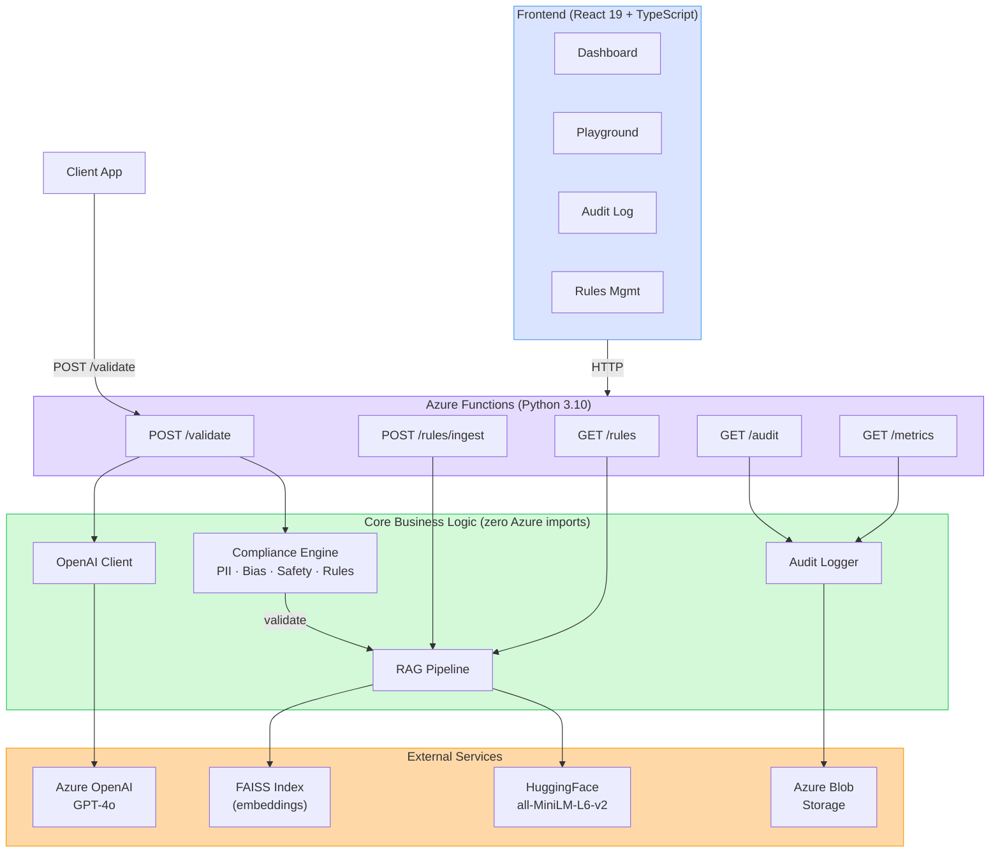

# SafeGen

[](https://safe-gen-dev.vercel.app)
[](LICENSE)
[](https://python.org)
[](https://azure.microsoft.com/en-us/products/functions)
[](https://react.dev)
[](https://typescriptlang.org)

**Responsible AI compliance middleware for LLM applications.**

SafeGen is a serverless pipeline that sits between your application and Azure OpenAI, validating every LLM response against configurable safety, bias, PII, and regulatory rules before serving to end users. Rules are loaded via RAG — update compliance policies by uploading a document, no redeployment needed.

## Key Features

- **Multi-Layer Compliance Engine** — PII detection, bias checking, safety filtering, and RAG-based rule evaluation run in sequence on every LLM response
- **RAG-Powered Policy Retrieval** — Upload compliance documents (PDF/DOCX/MD), automatically chunked and indexed in FAISS for semantic rule matching at inference time
- **Interactive Playground** — Type a prompt, submit it, and watch the compliance engine validate the LLM response in real-time with example prompts and category toggles
- **Real-Time Monitoring Dashboard** — React/TypeScript SPA with KPI cards, trend charts, flag breakdowns, and paginated audit logs
- **Full Audit Trail** — Every validation result logged with request/response payloads, compliance scores, and flag details for regulatory review
- **Dynamic Rule Updates** — Add or modify compliance rules without redeploying; rules are retrieved via semantic search at validation time

## Architecture

[](https://excalidraw.com/#json=AYeGdzU2odcXQHa4tp_DM,rXcDX6ii-NgvHYrm16a_Rg)



## Tech Stack

| Layer          | Technology                                         |
| -------------- | -------------------------------------------------- |
| **Runtime**    | Azure Functions v2 (Python 3.10), serverless       |
| **LLM**        | Azure OpenAI GPT-4o                                |
| **RAG**        | FAISS vector store, HuggingFace `all-MiniLM-L6-v2` |
| **Validation** | Regex-based PII, keyword bias, pattern safety      |
| **Storage**    | Azure Blob Storage (audit logs, rule documents)    |
| **Frontend**   | React 19, TypeScript, Vite, Tailwind CSS, Recharts |
| **UI Kit**     | shadcn/ui (Radix + Tailwind components)            |
| **Testing**    | pytest (backend, 150 tests), vitest (frontend, 53) |

## Project Structure

```
safegen/
├── backend/
│   ├── function_app.py                # Azure Functions entry point (blueprint registration)
│   ├── core/                          # Business logic (zero Azure Functions imports)
│   │   ├── models.py                  #   Pydantic v2 models (request/response schemas)
│   │   ├── openai_client.py           #   Azure OpenAI wrapper (GenerationResult)
│   │   ├── rag_pipeline.py            #   Text extraction → chunking → embedding → FAISS
│   │   ├── blob_storage.py            #   Azure Blob Storage CRUD
│   │   ├── compliance_engine.py       #   Orchestrates all validators, computes score
│   │   ├── validators.py              #   PIIDetector, BiasChecker, SafetyFilter
│   │   └── audit_logger.py            #   Dual-backend audit store (File/Blob)
│   ├── functions/                     # HTTP triggers (thin wrappers over core/)
│   │   ├── validate.py                #   POST /api/validate
│   │   ├── ingest_rules.py            #   POST /api/rules/ingest
│   │   ├── list_rules.py              #   GET  /api/rules
│   │   ├── audit.py                   #   GET  /api/audit
│   │   └── metrics.py                 #   GET  /api/metrics
│   └── tests/                         # 150 tests across 10 modules
│       ├── conftest.py                #   Shared fixtures (mock_env, mock clients)
│       ├── test_models.py             #   Pydantic validation (17 tests)
│       ├── test_openai_client.py      #   Azure OpenAI wrapper (7 tests)
│       ├── test_validate.py           #   /api/validate endpoint (13 tests)
│       ├── test_rag_pipeline.py       #   RAG pipeline (16 tests)
│       ├── test_ingest_rules.py       #   /api/rules/ingest (8 tests)
│       ├── test_compliance_engine.py  #   Compliance scoring (27 tests)
│       ├── test_validators.py         #   PII/bias/safety (40 tests)
│       ├── test_audit.py              #   /api/audit endpoint (10 tests)
│       ├── test_audit_logger.py       #   Audit store (6 tests)
│       └── test_metrics.py            #   /api/metrics endpoint (6 tests)
│
├── frontend/
│   ├── vite.config.ts                 # Vite + Tailwind + API proxy config
│   ├── vitest.config.ts               # Test config (jsdom + path aliases)
│   ├── components.json                # shadcn/ui configuration
│   └── src/
│       ├── App.tsx                     # BrowserRouter + route definitions
│       ├── main.tsx                    # React DOM entry point
│       ├── index.css                   # Tailwind v4 + light/dark design tokens
│       ├── types/index.ts             # TypeScript interfaces (1:1 backend mirror)
│       ├── services/api.ts            # Typed API client with error handling
│       ├── hooks/
│       │   ├── use-api.ts             #   Generic useApi<T> data-fetching hook
│       │   └── use-theme.ts           #   Dark mode toggle (localStorage)
│       ├── lib/
│       │   ├── utils.ts               #   cn() class merge helper
│       │   ├── constants.ts           #   Named constants, nav items, thresholds
│       │   └── format.ts              #   Score/date/duration formatters
│       ├── components/
│       │   ├── ui/                    #   shadcn components (button, card, table, etc.)
│       │   ├── layout/               #   Sidebar, Header, AppLayout
│       │   ├── dashboard/            #   KpiCard, TrendChart, FlagBreakdownChart, ScoreGauge
│       │   ├── playground/           #   PromptInput, ResultPanel, FlagList, ExamplePrompts
│       │   ├── audit/                #   AuditFilters, AuditTable, AuditPagination, AuditDetailModal
│       │   └── rules/                #   RuleUploader (drag-and-drop), RuleList
│       ├── pages/
│       │   ├── DashboardPage.tsx      #   KPI cards + charts, 60s auto-refresh
│       │   ├── PlaygroundPage.tsx     #   Live compliance validation playground
│       │   ├── AuditPage.tsx          #   Filterable table + detail modal
│       │   └── RulesPage.tsx          #   Upload zone + rule card grid
│       └── test/
│           ├── setup.ts               #   jest-dom matchers
│           └── mocks.ts              #   Factory functions for mock data
│
├── rules/                             # Sample compliance rule documents
│   ├── gdpr_content_rules.md          #   5 GDPR rules
│   ├── bias_detection_policy.md       #   5 bias detection rules
│   └── pii_handling_rules.md          #   4 PII handling rules
│
├── docker-compose.yml                 # Full stack: backend + frontend + Azurite
├── .github/workflows/ci.yml          # GitHub Actions CI (7 jobs)
├── .env.example                       # Required environment variables
├── ARCHITECTURE.md                    # System design + technical decisions
├── BUILDPLAN.md                       # Phase-by-phase build progress
└── CLAUDE.md                          # Developer guide for AI-assisted coding
```

## API Endpoints

| Method | Endpoint            | Description                                        |
| ------ | ------------------- | -------------------------------------------------- |
| `POST` | `/api/validate`     | Send prompt, get compliance-validated LLM response |
| `POST` | `/api/rules/ingest` | Upload compliance documents (PDF/DOCX/MD/TXT)      |
| `GET`  | `/api/rules`        | List all ingested rules with chunk counts          |
| `GET`  | `/api/audit`        | Paginated audit logs with date/status filters      |
| `GET`  | `/api/metrics`      | Aggregated stats, compliance rates, time series    |

### Example: Validate a Prompt

```bash
curl -X POST http://localhost:7071/api/validate \
  -H "Content-Type: application/json" \
  -d '{"prompt": "Explain data privacy best practices", "rules_category": "all"}'
```

Response:

```json
{
  "response": "Data privacy best practices include...",
  "compliance": {
    "passed": true,
    "score": 0.95,
    "flags": [],
    "layers_run": ["pii", "bias", "safety"]
  },
  "model": "gpt-4o"
}
```

## Compliance Engine

Four validation layers run in sequence on every LLM response:

| Layer      | What it checks                                                 | Severity     |
| ---------- | -------------------------------------------------------------- | ------------ |
| **PII**    | Email, phone, SSN, credit card, IPv4 (with smart exclusions)   | Critical     |
| **Bias**   | Gendered job titles, ableist language, stereotype patterns     | Warning      |
| **Safety** | Hate speech, violence instructions, self-harm content          | Critical     |
| **Rules**  | RAG retrieval of uploaded policy documents for rule compliance | Configurable |

**Scoring:** Start at 1.0, deduct 0.3 per critical flag, 0.1 per warning. Pass threshold: no critical flags.

## Getting Started

### Prerequisites

- Python 3.10+
- Node.js 18+
- Azure Functions Core Tools v4
- Azure OpenAI resource with GPT-4o deployment

### Backend

```bash
cd backend
python -m venv .venv
source .venv/bin/activate          # Windows: .venv\Scripts\activate
pip install -r requirements.txt
cp local.settings.example.json local.settings.json
# Fill in Azure OpenAI + Blob Storage credentials
func start                         # Runs on http://localhost:7071
```

### Frontend

```bash
cd frontend
npm install
npm run dev                        # Runs on http://localhost:5173, proxies /api to :7071
```

### Run with Docker

```bash
cp .env.example .env
# Fill in your Azure OpenAI credentials in .env
docker-compose up --build
# Backend:  http://localhost:7071
# Frontend: http://localhost:5173
# Azurite:  http://localhost:10000 (Blob emulator)
```

### Run Tests

```bash
# Backend (150 tests)
cd backend && python -m pytest tests/ -v --tb=short

# Frontend (53 tests)
cd frontend && npm run test:run
```

## Environment Variables

```
AZURE_OPENAI_ENDPOINT=https://your-resource.openai.azure.com/
AZURE_OPENAI_API_KEY=your-key
AZURE_OPENAI_DEPLOYMENT=gpt-4o
AZURE_STORAGE_CONNECTION_STRING=your-connection-string
AZURE_STORAGE_CONTAINER_RULES=compliance-rules
AZURE_STORAGE_CONTAINER_AUDIT=audit-logs
EMBEDDING_MODEL=all-MiniLM-L6-v2
```

## Build Progress

- [x] **Phase 1:** Core backend — Azure Functions + Azure OpenAI proxy
- [x] **Phase 2:** RAG pipeline — text extraction, chunking, FAISS indexing
- [x] **Phase 3:** Compliance engine — PII detection, bias check, safety filter
- [x] **Phase 4:** Metrics & audit — dual-backend logging, paginated retrieval, aggregated stats
- [x] **Phase 5:** React dashboard — KPI cards, trend charts, audit log, rules management
- [x] **Phase 6:** Docker + CI/CD — Dockerfiles, docker-compose (full stack), GitHub Actions pipeline
- [x] **Phase 7:** Interactive Playground — Live compliance validation with example prompts and category toggles
- [x] **Deployed** — Frontend on [Vercel](https://safe-gen-dev.vercel.app), backend on Azure Functions

## Design Decisions

| Decision                  | Choice                          | Why                                                      |
| ------------------------- | ------------------------------- | -------------------------------------------------------- |
| Serverless runtime        | Azure Functions v2 (Python)     | Scales to zero, pay-per-use, no infra to manage          |
| Vector store              | FAISS (in-memory)               | Fast, zero-infra, sufficient for policy-scale datasets   |
| Embeddings                | HuggingFace `all-MiniLM-L6-v2`  | Free, fast, good quality for semantic search             |
| Frontend framework        | React + Vite + TypeScript       | Fast dev cycle, type safety, large ecosystem             |
| UI components             | shadcn/ui (copy-paste, not npm) | Full control, Tailwind-native, no runtime dependency     |
| Backend/frontend boundary | Clean Architecture              | `core/` has zero Azure imports; fully testable           |
| Types strategy            | snake_case in TypeScript        | Matches JSON responses exactly; no transform layer       |
| Containerization          | Docker + docker-compose         | Reproducible local dev with Azurite blob emulator        |
| CI pipeline               | GitHub Actions (7 jobs)         | Parallel lint/test/build for backend + frontend + Docker |

## License

MIT
